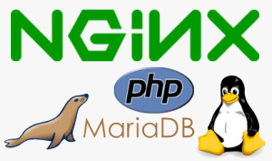
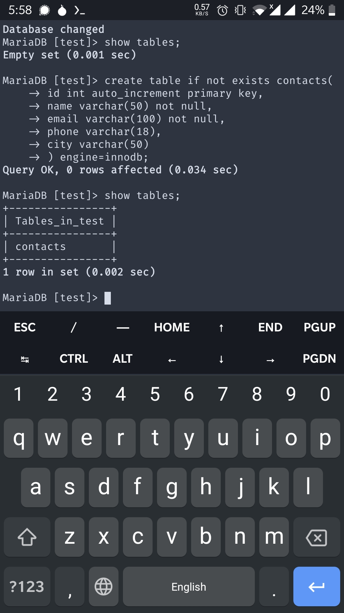
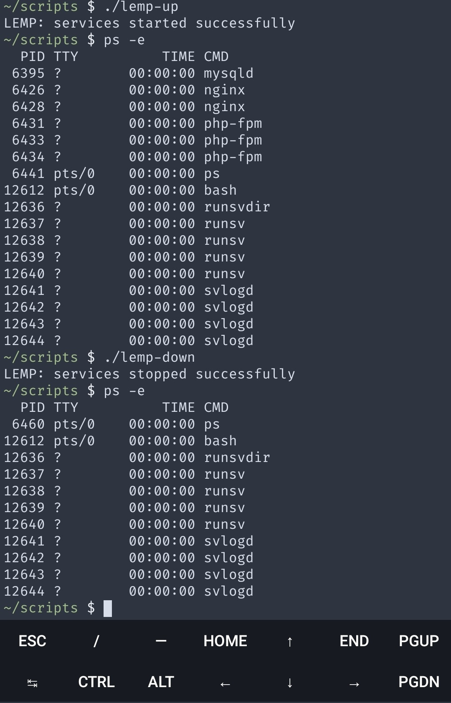

# LAMP Setup on Android



1. [What's it all about?](#Whats-it-all-about?)
2. [Installation](#Installation)
3. [Configurations](#Configurations)
    1. [PHP](#PHP)
    2. [Nginx](#Nginx)
        - [Document Root](#Document-Root)
    3. [Apache](#Apache)
    4. [MariaDB](#MariaDB)
4. [Services](#Services)
5. [Service Automation](#Service-Automation)
    - [LEMP service scripts](#LEMP-service-scripts)
6. [Test your Code](#Test-your-Code)

## What's it all about?

The ubiquitous LAMP stack is used for developing and deploying web applications written in PHP. Traditionally, LAMP consists of Linux, Apache, MySQL, and PHP. Due to its modular nature, the components can easily be swapped out. With LEMP, Apache is replaced with the lightweight yet powerful Nginx.

A LAMP/LEMP stack may be setup in a variety of flavors:

- lnmp(Linux + Nginx+ MySQL/MongoDB+ PHP)
- lamp(Linux + Apache+ MySQL/MongoDB+ PHP)
- lnmpa(Linux + Nginx+ MySQL/MongoDB+ PHP+ Apache):Nginx handling the static, Apache processing dynamic PHP
- lnpp(Linux + Nginx+ PostgreSQL+ PHP)
- lapp(Linux + Apache+ PostgreSQL+ PHP)

Commonly a LEMP Stack is setup on desktop or server Linux like:
- CentOS(redhat) 7~8
- Debian 8～11
- Ubuntu 16～22
- Fedora 27+
- Amazon Linux 2

However with the evolution of Termux Linux environment for Android OS, it has become possible to setup a multitude of development environments on handheld devices. 

A number of online tutorials have emerged outlining setup process for some development tools. However, I couldn't find a single comprehensive tutorial to guide through the setup of a LEMP (Nginx, MySQL, PHP) stack environment specifically. Therefore, I took upon myself to experiment and produce a single comprehensive tutorial for this purpose.

## Installation

Inside your termux app install PHP, Nginx and MariaDB

```bash
apt update && apt upgrade
apt install php-fpm nginx mariadb
```

or, with Apache httpd stack:

```bash
apt update && apt upgrade
apt install php-fpm apache2 php-apache mariadb
```
This will install all the required componants.

At the time of writing, the stack versions are:
- PHP 8.1.11 (fpm-fcgi)
- nginx/1.23.1
- Apache httpd 2.24
- mariadb  Ver 15.1 Distrib 10.9.2-MariaDB

## Configurations

### PHP

Edit the PHP config in `/data/data/com.termux/files/usr/etc/php-fpm.d/www.conf` (or `$PREFIX/etc/php-fpm.d/www.conf`) and set it to listen on a unix socket:
```
listen = /data/data/com.termux/files/usr/var/run/php-fpm.sock
```

Alternatively, you can also set it to listen on a IP address & TCP port like:
```
; 'ip.add.re.ss:port' to listen on a TCP socket
; to a specific IPv4 address on a specific port
listen = 127.0.0.1:9000
; 'port' to listen on a TCP socket to all
; addresses (IPv6 and IPv4-mapped) on a specific
; port
listen = 9000
```

### Nginx

The nginx default config directory is located at `/data/data/com.termux/files/usr/etc/nginx` or `$PREFIX/etc/nginx`. Open`nginx.conf` and edit it as follows.

Set error log location as:
```
error_log  /data/data/com.termux/files/usr/var/log/nginx/error.log;
```

Set your root location block as:
```
location / {
    root   /data/data/com.termux/files/usr/share/nginx/html;
    index  index.php index.html index.htm;
    try_files $uri $uri/ /index.html;
}
```

Uncomment and edit your php (`\.php$`) location block to look like:
```
location ~ \.php$ {
    try_files $uri =404;
    root           /data/data/com.termux/files/usr/share/nginx/html;
    fastcgi_pass unix:/data/data/com.termux/files/usr/var/run/php-fpm.sock;
    fastcgi_index  index.php;
    fastcgi_param  SCRIPT_FILENAME $document_root$fastcgi_script_name;
}
```

The original configuration file with proposed changes is included in the repo as `nginx.conf.full`. There's another cleaned up copy with comments & unnecessary configurations removed named as `nginx.conf`.

#### Document Root

The document root is a directory from where a web server serves webpages. Its path is mentioned in the `nginx.conf`. The default root is set to `/data/data/com.termux/files/usr/share/nginx/html`.

If you want to change the default document root directory (which you should) to make it easy on yourself to edit php files, change it to a directory in your $HOME, e.g.
```
root   /data/data/com.termux/files/home/htdocs;
```
on three places.
1. root location block (`location / {}`)
2. 50x location block (`location = /50x.html {}`)
3. PHP file location block (`location ~ \.php$ {}`)

For lazy people, just make a soft link to your document root directory in your termux home ($HOME).
```
# place soft link inside termux home
ln -s $PREFIX/share/nginx/html $HOME/htdocs
```

if you have setup the termux storage script, then you can place this soft link (or the document root itself) in your phone's sdcard. This'll simplify your workflow as you would be able to use a good code editor (like Acode etc.) to edit the php files.

### Apache

Insted of touching main config file `$PREFIX/etc/apache2/httpd.conf` we will create new config file that will be included in main config file.

Create new file in `$PREFIX/etc/apache2/conf.d/`:`

```bash
nano $PREFIX/etc/apache2/conf.d/termux-php.conf
```

Copy the following code to that file and save.

```
AddHandler php-script .php

ServerName 0.0.0.0

<IfModule dir_module>
        DirectoryIndex index.php
</IfModule>

LoadModule php_module libexec/apache2/libphp.so

<IfModule !mpm_worker_module>
        LoadModule mpm_prefork_module libexec/apache2/mod_mpm_prefork.so
</IfModule>
```
now save and exit the text editor.
 
Starting apache at this point we'll encouter an error: **PHP-Apache [Error – AH00013 : Pre-configuration failed]**.
This is because Apache runs the `mpm_worker_module` by default and the PHP Module in termux is not compatible with it. We already added the compatible module `mpm_prefork_module` in the configuration. We just need to comment out the `LoadModule` line for `mpm_worker_module` in `httpd.conf`:

```bash
sed -i 's|LoadModule mpm_worker|#LoadModule mpm_worker|g' $PREFIX/etc/apache2/httpd.conf
```
The default Document Root of Apache2 HTTP Server is `$PREFIX/share/apache2/default-site/htdocs/`. We can change this setting in a `DocumentRoot` block in default configuration file.

Start Apache2 Server
```bash
apachectl start
```

Or simply 
```bash
apachectl
```

### MariaDB

To access root account, you need to login with Termux user name
```
mysql -u $(whoami)
```

The command shown above will also initialize the database with 2 all-privilege accounts (introduced perhaps in MariaDB 10.4.x). The first one is "root" which is inaccessible and the second one with name of your Termux user (check with command id -un or whoami). 

To enable access to root account, you need to login with your Termux user name

```
mysql -u $(whoami)
```

and manually change password for root

```
use mysql;
set password for 'root'@'localhost' = password('YOUR_ROOT_PASSWORD_HERE');
flush privileges;
quit;
```

Verify that you are able to login as 'root' with `mysql -u root -p`. You will need to provide password set in previous step. 



Whenever you want to access MySQL database manually through command line or with some program (web application), you need to start MySQL server:

```
mysqld_safe
```

Then you should be able to connect to database, e.g. wwith`mysql -u root -p`. 


## Services

First start PHP with the command
```
php-fpm
```

Now test your nginx config by the command
```
nginx -t
```

if the test is successful, start nginx service with the command:

```
nginx
```

You can communicate with the nginx service with signals (stop, quit, reopen, reload) like:

```
nginx -s stop
```

Everytime you make a change to nginx config, you have to reload the service:
```
nginx -s reload
```

## Service Automation

[termux-services](https://github.com/termux/termux-services) contains a set of scripts for controlling services. Instead of putting commands in `~/.bashrc` or `~/.bash_profile`, they can be started and stopped with termux-services. It manages a wide variety of back-end services such as apache httpd, lighttpd, nginx, ftpd, sshd, mysqld, postgres, mosquitto, crond, privoxy and more.

To install termux-services, run
```
pkg install termux-services
```
and then **restart termux** so that the service-daemon is started.

To then enable and run a service, run
```
sv-enable <service>
```

for example
```
sv-enable nginx
```

If you only want to run it once, run
```
sv up <service>
```
for example
```
sv up mysqld
```

To later stop a service, run:
```
sv down <service>
```
for example
```
sv down mysqld
```

Or to disable it
```
sv-disable <service>
```

A service is disabled if `$PREFIX/var/service/<service>/down` exists, so the `sv-enable` and `sv-disable` scripts touches, or removes, this file.

termux-services uses the programs from [runit](http://smarden.org/runit/) to control the services. A bunch of example scripts are available from the [same site](http://smarden.org/runit/runscripts.html). If you find a script you want to use, or if you write your own, you can use set it up by running:
```
mkdir -p $PREFIX/var/service/<PKG>/log
ln -sf $PREFIX/share/termux-services/svlogger $PREFIX/var/service/<PKG>/log/run
```
and then put your run script for the package at `$PREFIX/var/service/<PKG>/run` and make sure it's runnable.

You can then run
```
sv up <PKG>
```
to start it.

Log files for services are located in `$PREFIX/var/log/sv/<PKG>/` with the active log file named "current".

For further configuration options check [termux wiki](https://wiki.termux.com/wiki/Termux-services) or [termux-services GitHub](https://github.com/termux/ttermux-services).

### LEMP service scripts

A couple of example scripts to start and stop LEMP services are also included in this repo. These scripts simplify the start and stop process for app developers.



## Test your Code

Finally, the moment of truth! Now that yor services are running, test some code.

Now write a `index.php` file in your document root.

```php
<?php
echo "<h1>Hello Android!</h1>";
```

To visit your first page, open a browser and write in the address bar:

```
localhost:8080
```

If everything went ok, you'll see the output of the echo in your browser. Viola!!!

Happy coding geeks!
